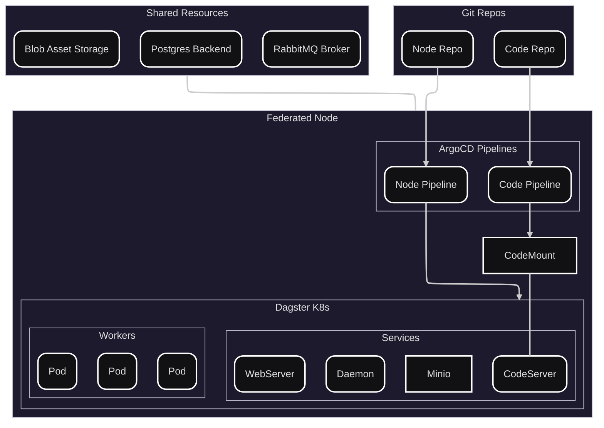

```mermaid
---
config:
  layout: elk
  look: classic
  theme: redux-dark
---
flowchart TD
 subgraph GitRepos["Git Repos"]
        NodeRepo("Node Repo")
        CodeRepo("Code Repo")
  end
 subgraph FederatedNode["Federated Node"]
        ArgoPipelines["ArgoPipelines"]
        DagsterK8s["Dagster"]
        CodeMount["CodeMount"]
  end
 subgraph ArgoPipelines["ArgoCD Pipelines"]
        NodePipeline["Node Pipeline"]
        CodePipeline["Code Pipeline"]
  end
 subgraph DagsterK8s["Dagster K8s"]
        DagsterWorkers["DagsterWorkers"]
        DagsterServices["DagsterServices"]
  end
 subgraph DagsterServices["Services"]
        Daemon["Daemon"]
        Minio["Minio"]
        CodeServer["CodeServer"]
        WebServer["WebServer"]
  end
 subgraph DagsterWorkers["Workers"]
        Pod1("Pod")
        Pod2("Pod")
        Pod3("Pod")
  end
 subgraph SharedResources["Shared Resources"]
        SharedBackend("Postgres Backend")
        SharedBroker("RabbitMQ Broker")
        AssetStorage("Blob Asset Storage")
  end
    CodeRepo --> CodePipeline
    NodeRepo --> NodePipeline
    NodePipeline --> DagsterK8s
    CodePipeline --> CodeMount
    CodeMount --- CodeServer
    SharedResources --- FederatedNode
    NodePipeline@{ shape: rounded}
    CodePipeline@{ shape: rounded}
    Daemon@{ shape: rounded}
    CodeServer@{ shape: rounded}
    WebServer@{ shape: rounded}
```