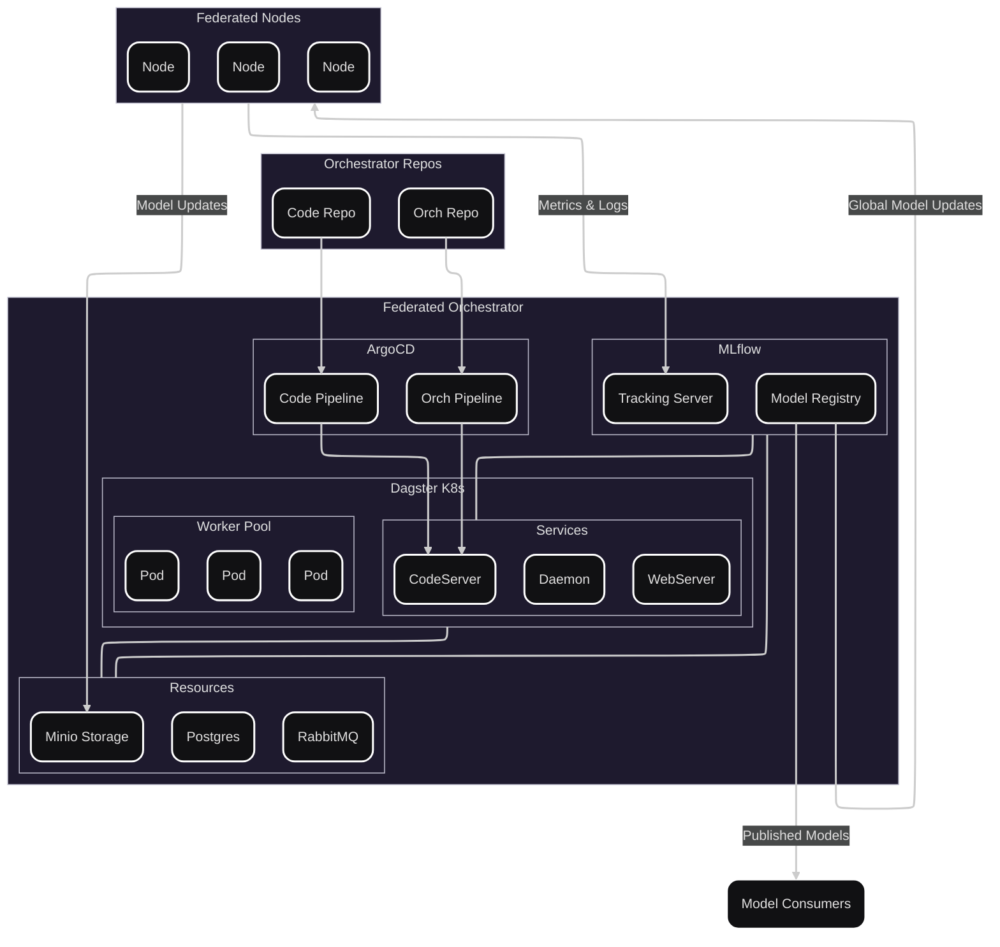

```mermaid
---
config:
  layout: elk
  look: classic
  theme: redux-dark
---
flowchart TD

  %% ------------------ Federated Nodes ------------------
  subgraph FederatedNodes["Federated Nodes"]
    Node1("Node")
    Node2("Node")
    Node3("Node")
  end

  %% ------------------ Orchestrator Git Repos ------------------
  subgraph OrchGitRepos["Orchestrator Repos"]
    OrchRepo("Orch Repo")
    OrchCodeRepo("Code Repo")
  end

  %% ------------------ Federated Orchestrator ------------------
  subgraph FederatedOrchestrator["Federated Orchestrator"]

    subgraph OrchArgoPipelines["ArgoCD"]
      OrchPipeline("Orch Pipeline")
      OrchCodePipeline("Code Pipeline")
    end

    subgraph OrchDagsterK8s["Dagster K8s"]
      direction RL
      subgraph OrchDagsterServices["Services"]
        OrchDaemon("Daemon")
        OrchCodeServer("CodeServer")
        OrchWebServer("WebServer")
      end
      subgraph OrchDagsterWorkers["Worker Pool"]
        OrchWorkerPod1("Pod")
        OrchWorkerPod2("Pod")
        OrchWorkerPod3("Pod")
      end
    end

    subgraph OrchResources["Resources"]
      OrchestratorArtifactStorage("Minio Storage")
      OrchestratorResultsBackend("Postgres")
      OrchestratorBroker("RabbitMQ")
    end

    subgraph MLflow["MLflow"]
      Tracking("Tracking Server")
      Registry("Model Registry")
    end

  end

  %% ------------------ External ------------------
  ModelConsumers("Model Consumers")

  %% ------------------ Connections ------------------
  OrchRepo --> OrchPipeline --> OrchCodeServer
  OrchCodeRepo --> OrchCodePipeline --> OrchCodeServer
  OrchDagsterK8s --- OrchResources

  %% MLflow wiring
  MLflow --- OrchResources
  MLflow --- OrchDagsterServices

  %% Publication
  Registry -->|Published Models| ModelConsumers
  Registry -->|Global Model Updates| FederatedNodes

  %% Federated node contributions
  FederatedNodes -->|Model Updates| OrchestratorArtifactStorage
  FederatedNodes -->|Metrics & Logs| Tracking
```
