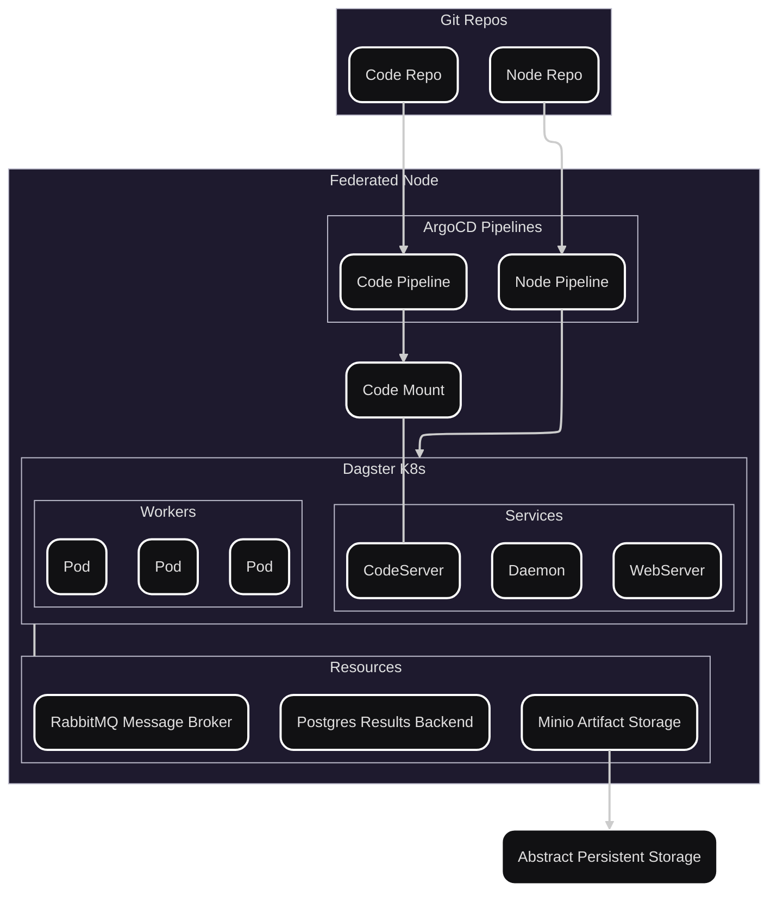

# Architecture Diagram

```mermaid
---
config:
  layout: elk
  look: classic
  theme: redux-dark
---
flowchart TD
  subgraph GitRepos["Git Repos"]
    NodeRepo("Node Repo")
    CodeRepo("Code Repo")
  end

  subgraph FederatedNode["Federated Node"]
    subgraph ArgoPipelines["ArgoCD Pipelines"]
      NodePipeline("Node Pipeline")
      CodePipeline("Code Pipeline")
    end

    subgraph DagsterK8s["Dagster K8s"]
      subgraph DagsterWorkers["Workers"]
        K8sPod1("Pod")
        K8sPod2("Pod")
        K8sPod3("Pod")
      end

      subgraph DagsterServices["Services"]
        Daemon("Daemon")
        CodeServer("CodeServer")
        WebServer("WebServer")
      end
    end

    CodeMount("Code Mount")

    subgraph DagsterResources["Resources"]
      ArtifactStorage("Minio Artifact Storage")
      ResultsBackend("Postgres Results Backend")
      CeleryBroker("RabbitMQ Message Broker")
    end
  end

  ResultsStorage("Abstract Persistent Storage")

  CodeRepo --> CodePipeline
  NodeRepo --> NodePipeline
  NodePipeline --> DagsterK8s
  CodePipeline --> CodeMount
  CodeMount --- CodeServer
  DagsterK8s --- DagsterResources
  ArtifactStorage --> ResultsStorage
```
