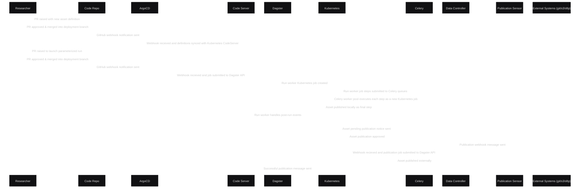

```mermaid
---
config:
  layout: elk
  look: classic
  theme: redux-dark
---
sequenceDiagram
    participant Researcher
    participant CodeRepo as Code Repo
    participant ArgoCD
    participant CodeServer as Code Server
    participant Dagster as Dagster
    participant K8s as Kubernetes
    participant Celery
    participant DataController as Data Controller
    participant PubSensor as Publication Sensor
    participant External as External Systems (git/s3/sftp)

    %% --- Initial asset definition ---
    Researcher->>CodeRepo:  PR raised with new asset definition
    CodeRepo-->>Researcher: PR approved & merged into deployment branch
    CodeRepo->>ArgoCD: GitHub webhook notification sent
    ArgoCD->>CodeServer: Webhook recieved and definitions synced with Kubernetes CodeServer

    %% --- Launching run ---
    Researcher->>CodeRepo: PR raised to launch parameterized run
    CodeRepo-->>Researcher: PR approved & merged into deployment branch
    CodeRepo->>ArgoCD: GitHub webhook notification sent
    ArgoCD->>Dagster: Webhook recieved and job submitted to Dagster API

    %% --- Run execution ---
    Dagster->>K8s: Run worker Kubernetes job created
    K8s->>Celery: Run worker job steps submitted to Celery queues
    Celery->>K8s: Celery worker pool executes each step as a new Kubernetes job
    Celery-->>Dagster: Asset published locally as final step
    Dagster->>Dagster: Run worker handles post-run events

    %% --- Publication approval ---
    Dagster->>DataController: Asset pending publication notice sent
    DataController-->>Dagster: Asset publication approved
    DataController->>PubSensor: Publication webhook message sent
    PubSensor->>Dagster: Webhook recieved and publication job submitted to Dagster API
    Dagster->>External: Asset published externally
    External-->>Researcher: Successful publication message sent
```