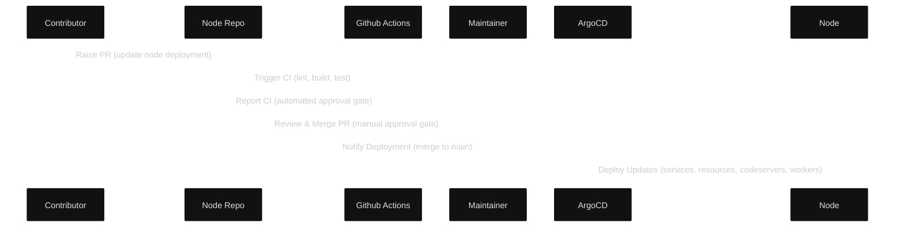
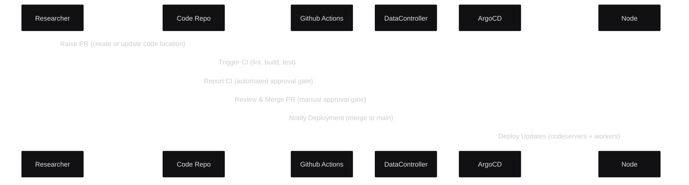
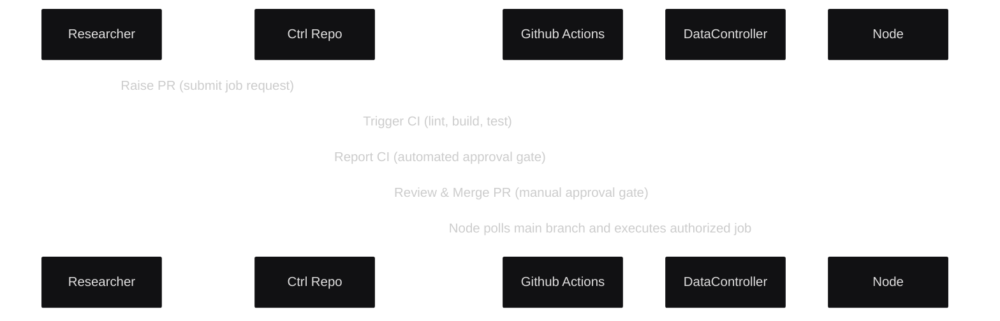
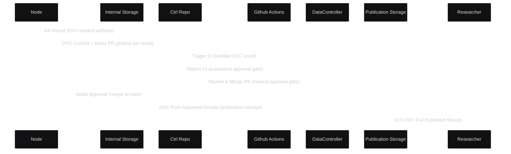

# Project Lifecycle

## NODE

**Deploy Node**

```mermaid
---
config:
  layout: elk
  look: classic
  theme: redux-dark
---
sequenceDiagram
    participant Contributor
    participant Repo as Node Repo
    participant GhActions as Github Actions
    participant Maintainer
    participant ArgoCD
    participant Node

    Contributor->>Repo: Raise PR (update node deployment)
    Repo->>GhActions: Trigger CI (lint, build, test)
    GhActions-->>Repo: Report CI (automated approval gate)
    Maintainer->>Repo: Review & Merge PR (manual approval gate)
    Repo-->>ArgoCD: Notify Deployment (merge to main)
    ArgoCD->>Node: Deploy Updates (services, resources, codeservers, workers)
```

## CODE

**Deploy Code**

```mermaid
---
config:
  layout: elk
  look: classic
  theme: redux-dark
---
sequenceDiagram
    participant Researcher
    participant Repo as Code Repo
    participant GhActions as Github Actions
    participant DataController
    participant ArgoCD
    participant Node

    Researcher->>Repo: Raise PR (create or update code location)
    Repo->>GhActions: Trigger CI (lint, build, test)
    GhActions-->>Repo: Report CI (automated approval gate)
    DataController->>Repo: Review & Merge PR (manual approval gate)
    Repo-->>ArgoCD: Notify Deployment (merge to main)
    ArgoCD->>Node: Deploy Updates (codeservers + workers)
```

## CTRL

**Submit Job**

```mermaid
---
config:
  layout: elk
  look: classic
  theme: redux-dark
---
sequenceDiagram
    participant Researcher
    participant Repo as Ctrl Repo
    participant GhActions as Github Actions
    participant DataController
    participant Node

    Researcher->>Repo: Raise PR (submit job request)
    Repo->>GhActions: Trigger CI (lint, build, test)
    GhActions-->>Repo: Report CI (automated approval gate)
    DataController->>Repo: Review & Merge PR (manual approval gate)
    Repo-->>Node: Node polls main branch and executes authorized job
```

**Publish Results**

```mermaid
---
config:
  layout: elk
  look: classic
  theme: redux-dark
---
sequenceDiagram
    participant Node
    participant InternalStorage as Internal Storage
    participant Repo as Ctrl Repo
    participant GhActions as Github Actions
    participant DataController
    participant PublicationStorage as Publication Storage
    participant Researcher

    Node->>InternalStorage: Job Result (DVC-tracked artifacts)
    Node->>Repo: DVC Commit + Raise PR (publish job result)
    Repo->>GhActions: Trigger CI (validate DVC result)
    GhActions-->>Repo: Report CI (automated approval gate)
    DataController->>Repo: Review & Merge PR (manual approval gate)
    Repo-->>Node: Notify Approval (merge to main)
    Node->>PublicationStorage: DVC Push Approved Results (publication storage)
    Researcher->>PublicationStorage: GIT+DVC Pull Published Results
```
